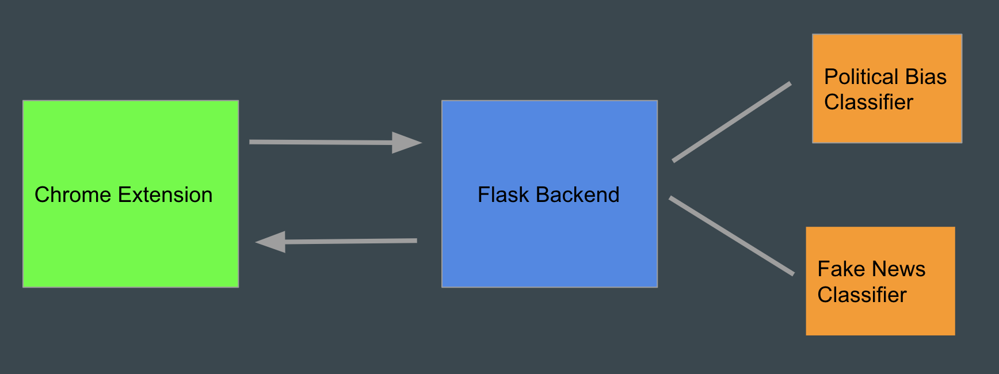

# NewsClassifierChromeExtension

## Inspiration

After watching the social dilemma, we realized that media that we consume in our daily lives through social media and browsing the internet can have a profound impact on our thought processes and views on the world. Especially with election season coming up, we believe that it is important to be aware of media bias and focus on truth. We decided to create a chrome extension that allows users to be aware of biases that they may be exposed to as they browse the web.

## How it works

Our extension scrapes the webpage that a user is on as they browse it. Content from the webpage is set to our backend server where that information is analyzed. There we check whether the content has a political bias or has a high chance of being fake news by running it through LSTM neural networks. We then display this information to the user in a popup in their browser.

## Languages Used

* Python
  * Flask
  * Keras
  * PyTorch
* Javascript
* HTML/CSS

## What's next

We want to add additional features for users to be able to analyze their browsing trends and find ways to more true and neutral information. We plan on doing so by creating more in-depth visualizations so that users can track their browsing behavior. In addition, we want to suggest alternate websites about the same topic that have less political bias.

## Demo

